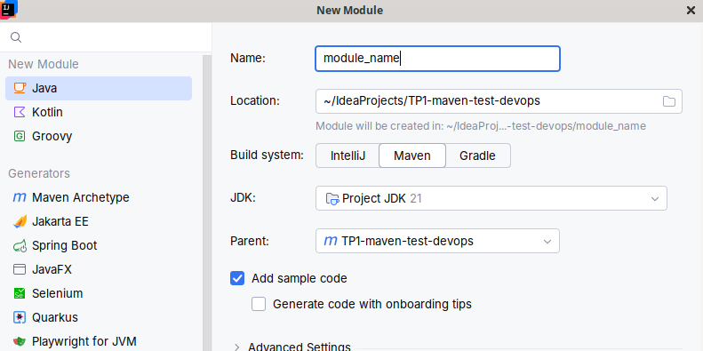
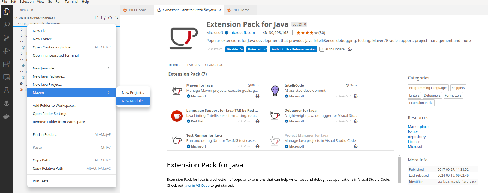

# TP1 Maven - Refactoring - Test

Bienvenue dans ce TP orienté tests de DevOps. Ce TP a pour objectif de vous plonger dans une application Java de 
taille suffisamment raisonnable pour correspondre à un module d'un projet industriel, mais aussi suffisament petit pour
vous puissiez vous y retrouver. 

Ce TP va avoir plusieurs objectifs pédagogiques : 
* Etre parachuté.e sur un projet que l'on ne connait pas dont il faut apprendre les points d'entrées et les éléments qui le compose.
* Etre confronté.e à un projet qui ne fonctionne pas nativement et qu'il faut corriger
* Tester l'application et fixer des bugs détectés par les tests / implémenter des nouveaux tests
* Refactorer l'application pour la modulariser avec Maven
* Decouvrir le test fonctionnel avec Cucumber

## Environnement de travail

Nous utiliserons dans ce TP :
* Un JDK21
  * Pour installer le JDK21 sur votre machine (Ubuntu, Debian, Mint): `sudo apt install openjdk-21-jdk`
  * Pour changer sur votre machine (Ubuntu, Debian, Mint): `sudo update-alternatives --config java`
* Maven
* Un IDE de préférence IntelliJIDEA

**LA SPECIFICATION** du code est la Javadoc du code commenté (ce n'est pas l'idéal, mais pour ce TP ça fait très bien le boulot). Elle n'est pas buguée volontairement
contrairement au code, vous pouvez donc lui faire confiance pour implémenter vos tests et corriger les 
bugs trouvés dans l'application.

## 1) Correction des bugs existants et implémentation de tests unitaires avec JUnit 5

Vous allez pouvoir lancer un `mvn clean install` ce qui mettra en lumière le fait que le projet ne build 
pas correctement. Charge à vous de corriger ce qui ne va pas lié au build puis de relancer la commande.
Vous allez ensuite exècuter les différents Main (`MainCoffee` et`MainEspresso`) et vérifier si oui ou non cela fonctionne bien. 
Vous trouvez sûrement des problèmes à l'exécution qu'il faudra fixer. 
Pour cela, vous allez tester unitairement les différents composants (package `fr.insa.cours.devops.coffee.machine.component`) ainsi que la `CoffeeMachine`.
Les tests se feront avec JUnit5 et sur les méthodes "métiers" des classes mais nous exclurons les getters et les setters. 
N'oubliez pas de tester la levée d'exceptions, vous avez un exemple ici : 
```java
Assertions.assertThrows(CupNotEmptyException.class, ()->{
    coffeeMachineUnderTest.makeACoffee(mockCup, CoffeeType.MOKA);
});
```

Ces tests vous permettrons par la suite de vérifier vos refactoring mais aussi de valider les fixs.

### Fix pour le mock de Random.class

Certaines configurations (liées au JDK et à sa version) empêche le mock de la classe `Random` (warning de sécurité remonté par la JVM). Pour fixer l'erreur et pourvoir mocker random il faut utiliser
la ligne Java suivante : 
```java
Mockito.mock(Random.class, withSettings().withoutAnnotations());
```

## 2) Refactoring par modulurisation de l'application avec Maven

Actuellement ce projet est dans un état dans lequel vous ne disposez que d'un `pom.xml` à la racine du projet (l'entièreté du projet est un module).
Nous allons modifier le projet pour créer un projet contenant un `pom.xml` de packaging à la racine et deux sous-modules qui seront :
* coffee-machine : contiendra les sources Java du package `fr.insa.cours.devops.coffee.machine`
* storage cupboard : contiendra les sources Java du package `fr.insa.cours.devops.coffee.cupboard`

Ainsi, nous séparerons clairement 2 préoccupations de l'application à savoir les "les contenants" de la "machine".
On pourrait également imaginer réutiliser les "contenants" ou la "machine" dans d'autres projets, d'où une modularisation par Maven. 

Premièrement, vous devez passer le packaging du pom du projet comme ceci :
```xml
...
<groupId>fr.insa.cours.devops.coffee</groupId>
<artifactId>TP1-maven-test-devops</artifactId>
<version>1.0-SNAPSHOT</version>
<packaging>pom</packaging>
...
```

 ### Dans IntelliJIDEA

Ensuite vous allez créer les 2 modules. Pour créer un module dans IntelliJ, faites un click droit sur la racine du projet
puis "New" --> "Module...". Vous obtiendrez alors une fenêtre vous permettant de créer le module. $
Faites attention à bien parametrer le module comme l'image ci-dessous :



Créer ensuite les nouveaux packages dans chacun des modules et bougé les sources Java pour les 
mettre dans les bons modules et les bons packages 

### Dans VSCode

Pour créer un module dans VScode vous pouvez procéder d'une manière similaire à IntelliJ.
Click droit sur la racine du projet puis "Maven" --> "New Module..."

**/!\ Pour pouvoir effectuer cette action vous devez installer le pack de plugins "Extension Pack for Java".**



### Pour créer un module en ligne de commande 

Une autre option pour créer vos modules est de le faire avec la commande suivante : 

```shell
mvn archetype:generate -DgroupId=fr.insa.cours.devops.coffee -DartifactId=nom_module_à_créer
```


## 3) Création de tests fonctionnels avec Cucumber

Maintenant que vous avez vos modules vous allez pouvoir couvrir les fonctionnalités de votre machine
(faire du café de différents types dans différents contenants).
Pour cela la première chose à faire est de rajouter les dépendances nécessaires dans le `pom.xml`
du module maven concerné.
Deux dépendances sont nécessaires et à chercher sur le site : [https://mvnrepository.com/](https://mvnrepository.com/)
* cucumber-junit, version 7.30.0
* cucumber-java, version 7.30.0

**Ces deux dépendances sont à utiliser en version 7.30.0. Penser à utiliser les proporties de Maven
pour mutualier le réglage des versions sur les 2 dépendances**

Ensuite, vous allez devoir créer un dossier `resources` dans `src/test`. Puis dans ce dossier `resources` faite un 
dossier `features` pour stocker proprement vos `.feature` de Cucumber.
Vous allez créer aussi dans `src/test/resources` un fichier `cucumber.properties` que vous allez peupler
avec le contenu suivant : 
```properties
cucumber.publish.enabled=false
```
Cela évitera que Cucumber ne retourne une erreur de publication sur un serveur externe du rapport de tests.

Dans le package `fr.insa.cours.devops.coffee.machine` de `src/test` créé un package `cucumber.steps` où 
seront rangées les classes permettant la définition des steps Java Cucumber. 

Enfin dernière chose pour mettre en place l'infrastructure de test, créé une classe CoffeeMachineCucumberFunctionalTest, 
dont le contenu sera le suivant dans `fr.insa.cours.devops.coffee.machine`. Cette classe permettra de faire le lien entre
vos fichiers ``.feature`` et les différentes étapes de tests que vous implémenterez dans `fr.insa.cours.devops.coffee.machine.cucumber.steps`
De plus, elle va permettre d'exécuter vos tests fonctinnels avec le runner de test de Cucumber et non celui JUnit5
```java
/**
 * Classe qui permet de faire le lien entre le fichier "make_a_coffee.feature" et la classe implémentant les étapes
 * de test CoffeeMachineTestFunctionalTest.java
 */
@RunWith(Cucumber.class)
@CucumberOptions(
        features = {"classpath:/features/"},
        glue = "fr.insa.cours.devops.coffee.machine.cucumber.steps"
)
//Permet d'ignorer les tests fonctionnels de Cucumber
//Ne lance pas la class CoffeeMachineFunctionalTest
@Ignore
public class CoffeeMachineCucumberFunctionalTest {

}

```

Maintenant, vous avez l'infrastructure de tests aussi appelée en génie logiciel le "harnais de test" complétement installée. 
Vous allez pouvoir implanter des tests en Cucumber. Créez un fichier `addition.feature` dans le dossier feature.
Remplissez ensuite ce dossier avec un Given, When, Then très simple comme : 
* Étant donné 2 nombres 4.0 et 6.0
* Quand je fais l'addition.
* Alors j'obtiens 10.0

La documentation sur la syntaxe Gherkin dans Cucumber est disponible au lien suivant : [https://cucumber.io/docs/gherkin/reference/](https://cucumber.io/docs/gherkin/reference/).
Je vous ai également rajouté un petit bout de cours en PDF sur Cucumber et le Behavior Driven Development à la racine du projet.


C'est un test très simple et c'est un jouet, mais c'est pour que vous puissiez vérifier que tout fonctionne bien; 
Vous allez pouvoir créer dans `fr.insa.cours.devops.coffee.machine.cucumber.steps` la classe Java `StepsAdditionTest` par exemple
où vous allez glisser les steps defs qui correspondent au tout petit test du dessus

Pour rédiger vos steps def en Java vous pouvez vous appuyer de la documentation en Java de Cucumber disponible ici :
[https://cucumber.io/docs/cucumber/step-definitions/?lang=java](https://cucumber.io/docs/cucumber/step-definitions/?lang=java)

Lancez ensuite le test de la feature. Si cela fonctionne, créez un nouveau fichier de feature `make_a_coffee.feature.` puis ajoutez un scenario réel cette fois-ci pour tester fonctionnellement
le bon fonctionnement de la machine à café avec différents "contenants" et différents types de café. N'oubliez pas ensuite
de créer la classe Java pour vos steps defs et de peupler cette classe avec comme vous l'avez fait avec l'addition précédemment.


## Diagrammes de classes du projet

### Package fr.insa.cours.devops.coffee.machine


### Package fr.insa.cours.devops.coffee.cupboard

