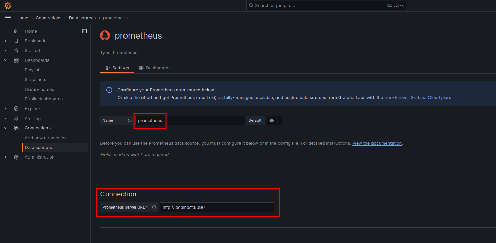
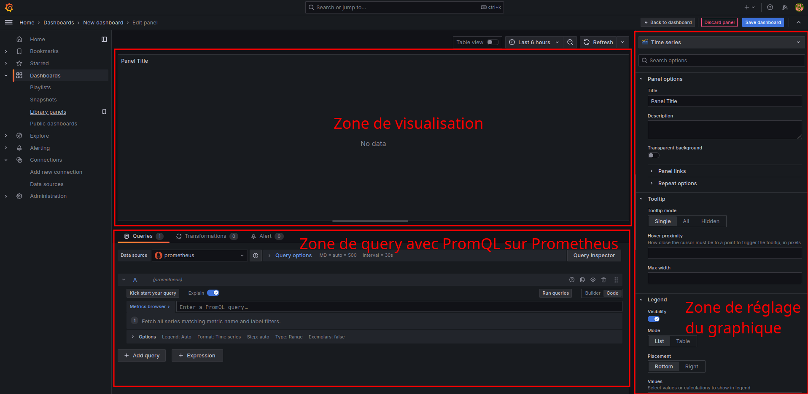
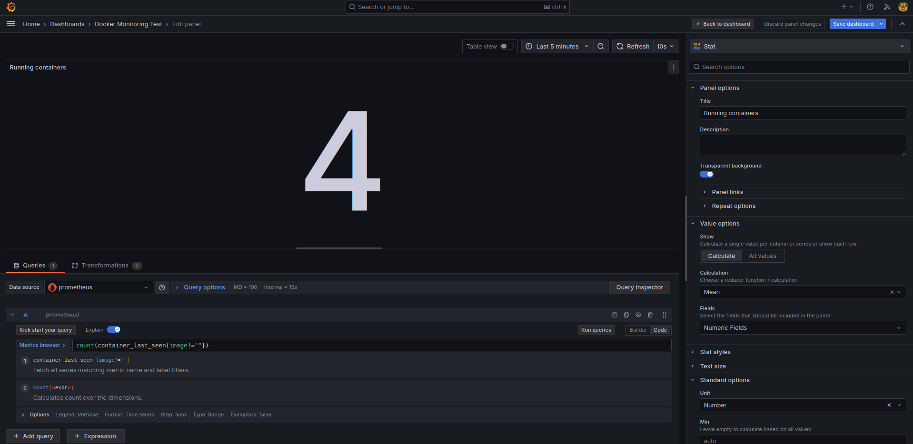
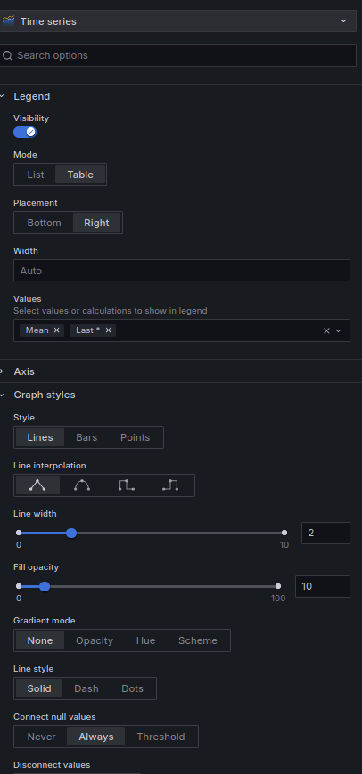

# TP Monitoring d'application Spring, de JVM et de conteneurs Docker avec Grafana, cAdvisor, Prometheus et Micrometer

Ce TP a pour objectifs de vous faire réaliser les choses suivantes : 
* Savoir déployer une stack docker compose
* Mettre en œuvre des sondes au sein d'applications Spring avec Micrometer
* Collecter des metrics avec cAdvisor et Prometheus
* Créer des tableaux de bord avec Grafana

## FIX à appliquer (suivant les configs et les problèmes)
- distribution Arch based, faire un `echo "127.0.0.1 $HOSTNAME" |sudo tee -a /etc/hosts + "::1"`
- Droits d'accès aux dossiers Prometheus et Grafana faire un `chown -R 1000:1000`
- Problèmes de localtime sur Ubuntu avec dual boot Windows/Linux. Attention à bien être à l'heure courante sur votre machine.

## Pré-requis indispensable l'installation de docker

:warning: **TP à effectuer sous Linux, je refuserai toute assistance à une machine Windows tentant de le réaliser. C'est à vos risques et périls.**

Le principal pré-requis à ce TP est de disposer de Docker sur la machine sur laquelle le TP va être réalisé. 
Pour installer Docker sur votre machine, vous utiliserez la documentation à la page suivante 
(**Attention, veillez à prendre le bon OS, ici, c'est Ubuntu**) : 
[https://docs.docker.com/engine/install/ubuntu/](https://docs.docker.com/engine/install/ubuntu/). 
Pour installer Docker utilisez la section de la documentation : _Install using the apt repository_

Réalisez ensuite les étapes post-installation qui sont décrites sur cette page : 
[https://docs.docker.com/engine/install/linux-postinstall/](https://docs.docker.com/engine/install/linux-postinstall/). 
Cela permet principalement de ne pas avoir à utiliser les commandes Docker avec `sudo` et de démarrer le 
daemon `Docker.service`.

Normalement la commande :
```bash
docker run hello-world
```
Devrait retourner :
```
Hello from Docker!
This message shows that your installation appears to be working correctly.
```

## Mise en place des briques technologiques de la stack

### 1) Création de l'arborescence et des fichiers nécessaires
Créer un dossier `docker_stack` à la racine du projet, puis dans ce dossier, créez les fichiers et l'arborescence suivante :
```
├── compose.yml
├── grafana (==> c'est un dossier)
└── prometheus
    └── config
        └── prometheus.yaml
```
### 2) Ajout des briques dans le docker compose (`compose.yml`)

Commencer par ajouter dans le docker compose Prometheus. Prometheus est un logiciel de monitoring de systèmes
basé sur des séries temporelles. Il permet à une fréquence donnée de scraper diverses sources de données (Sondes micrometer, 
cAdvisor, JMX, OpenTelemetry, etc.). Pour requêter sur Prometheus, il faut utiliser un langage dédié : 
le [PromQL](https://promlabs.com/promql-cheat-sheet/). Nous y reviendrons plus tard quand nous créerons nos 
tableaux de bord. 

Voici le code à ajouter dans le fichier `compose.yml`
```yaml
version: '3.8'

services:
  prometheus: #Nom du service
    image: prom/prometheus:v2.55.0 #image
    container_name: prometheus #Nom du conteneur
    ports:
      - 9090:9090 #Port partagé [machine hôte]:[conteuneur]
    command:
      - '--config.file=/etc/prometheus/prometheus.yaml' #fichier de configuration de prometheus pour le scrapiong
    volumes:
      - ./prometheus/config/prometheus.yaml:/etc/prometheus/prometheus.yaml:ro #Partage des volumes pour l'accès aux fichiers et données scrappées
      - ./prometheus/data:/prometheus/data
    restart: unless-stopped
    user: "1000:1000" #Définition des droits utilisateurs
    network_mode: "host" #Utilisation du réseau de la boucle locale de votre machine
```

Cependant, seul, Prometheus ne permet pas d'affichage, voilà pourquoi nous allons également rajouter Grafana pour
nous permettre de créer les tableaux de bord. Grafana vous permet de créer très facilement des dashboards spécifiques et
aux petits oignons par rapport à votre besoin métier. Il s'interface avec un grand nombre de sources de données (Graphene,
Prometheus, InfluxDB, Loki, Brokers MQTT, etc.). 
Les dashboards Grafana peuvent servir tant pour de l'IoT, que de la surveillance d'alimentation électrique de racks 
serveurs ou encore pour du monitoring en production d'infrastructures logicielles. Sa versatilité est sa force. 
De plus, l'interface de Grafana est relativement ergonomique au regard des possibilités qui sont offertes par l'outil. 

Voici le code à ajouter dans le fichier `compose.yml` :
```yaml
  grafana:
    image: grafana/grafana-oss:latest
    container_name: grafana
    ports:
      - 3000:3000
    volumes:
      - ./grafana/grafana:/var/lib/grafana
      - ./grafana/grafana/dashboards:/var/lib/dashboards
    restart: unless-stopped
    user: "1000:1000"
    network_mode: "host"
```

Nous allons aussi vouloir monitorer nos conteneurs Docker. 
Pour cela, nous allons utiliser [cAdvisor (Container Advisor)](https://github.com/google/cadvisor). 
cAdvisor est un outil qui est développé par Google. cAdvisor permet de mieux comprendre l'utilisation des ressources et les 
caractéristiques de performance des conteneurs en cours d'exécution. Il s'agit d'un daemon (ici un conteneur) qui collecte, agrège, traite 
et exporte des informations sur les conteneurs en cours d'exécution. Ainsi pour chaque conteneur, 
il conserve les paramètres d'isolation des ressources, l'historique de l'utilisation des ressources, 
l'historique complet de l'utilisation des ressources et les statistiques du réseau. 
Ces données sont exportées par conteneur et à l'échelle de la machine.

Voici le code à ajouter dans le fichier `compose.yml` :
```yaml
  cadvisor:
    image: gcr.io/cadvisor/cadvisor
    volumes: #Ensemble des volumes nécessaires pour la collecte des métriques depuis le conteuneur cAdvisor
      - /:/rootfs:ro
      - /var/run:/var/run:ro
      - /sys:/sys:ro
      - /var/lib/docker/:/var/lib/docker:ro
      - /dev/disk/:/dev/disk:ro
    ports:
      - "8080:8080"
    privileged: true
    devices:
      - /dev/kmsg
    network_mode: "host"
```

Enfin, nous allons faire remonter des métriques liées à la JVM avec JMX-Exporter. Voici le code à ajouter dans le fichier `compose.yml` :
```yaml
  jmx-exporter:
    image: sscaling/jmx-prometheus-exporter
    network_mode: "host"
    ports:
      - 5556:5556
```

### 3) Définition des sources de données à scraper par Prometheus  

Prometheus fonctionne avec un fichier de configuration `prometheus.yaml` qui permet de définir les sources de données
à scrapper ainsi que la fréquence d'actualisation. Vous pouvez voir cela comme une forme d'abonnement à un flux
RSS où Prometheus vient faire du polling à une fréquence donnée sur ces flux. 

Pour cela, vous allez ajouter la configuration suivante dans le fichier `prometheus.yaml` (chance pour vous, je vous donne
déjà la configuration entière avec les ports qui vont bien ;) ) :
```yaml
global: #Définition des options globales à Prometheus
  scrape_interval: 15s #Interval de temps pour le Scrapping

scrape_configs: #Configuration des sources de scrapping
  - job_name: 'prometheus'
    static_configs: 
      - targets: ['localhost:9090'] #Configuration du endpoint renvoyant des métriques 

  - job_name: 'docker'
    static_configs:
      - targets: ['172.17.0.1:9323'] 

  - job_name: 'cadvisor'
    static_configs:
      - targets: ['172.17.0.1:8080']

  - job_name: 'jmx-exporter'
    static_configs:
      - targets: ['jmx-exporter:5556']
```

**Pour la suite sur la syntaxe PromQL de Prometheus, je vous donne une fiche mémo [ici à la racine du TP](./Memo_PromQL.md)** (je suis honnête
cette fiche a été générée par ChatGPT, c'est un condensé en français de la doc).

### 4) Démarrage de la stack techno 

Poour démarrer la stack, ouvrez un terminal et placez-vous dans le dossier `docker_stack`. 
Puis démarrez votre infrastructure avec la commande : 
```shell
docker compose up
```
**Ne fermez pas le terminal !***

Normalement tout devrait bien se passer. Vous devriez avoir accès depuis votre navigateur à :
* [http://localhost:3000](http://localhost:3000) : Grafana
* [http://localhost:8080/containers/](http://localhost:8080/containers/) : Interface basique de cAdvisor
* [http://localhost:5556/](http://localhost:5556/) : métriques brutes de la JVM remontées par JPX-explorer

### 5) Accès à Grafana et premier tableau de bord

Vous allez maintenant accéder à Grafana avec l'URL `localhost:3000`. Étant donné que c'est la première fois que vous 
ouvrez Grafana, il va vous demander de choisir un couple username/password, mettez "admin/admin" pour être au plus simple; 

#### 5.1) Définition de la source de données

Avant de créer un dashboard, vous devez d'abord configurer la source de données où Grafana va obtenir ses données, 
ici, ce sera Prometheus. Depuis le Home de Grafana allez dans "Connections" ==> "Data sources" ==> Bouton "+ Add new data source".
Paramètrez ensuite votre data source comme dans l'image ci-dessous :



#### 5.2) Création du premier dashboard 

Pour créer votre premier dashboard allez dans "Dashboard" puis "Add new vizualization", sélectionnez ensuite comme source
de données "prometheus". 

Vous allez vous retrouver face à l'interface suivante :



#### 5.3) Création d'un compteur de conteneurs actifs (type Stat)

Pour démarrer en douceur, nous allons créer un afficheur (type Stat) du nombre de conteneurs actuellement actifs sur votre machine. 
Dans le panneau de requête, rentrez la requête PromQL suivante : 
```
count(container_last_seen{image!=""})
```
Cette requête va utiliser la métrique `container_last_seen` en selectionnant l'ensemble des containers ayant actuellement
une image != "". Elle utilise ensuite la fonction d'aggrégation `count(...)` pour compter le nombre de conteneurs. 

Paramètrez votre graphe pour obtenir l'affichage ci-dessous :


Ensuite, pensez à sauvegarder le dashboard. 

#### 5.4) Création d'un afficheur (type Stat) de l'usage CPU par les conteneurs

Nous allons créer un afficheur (type Stat) de l'usage CPU par les conteneurs en pourcents.
Dans le panneau de requête, rentrez la requête PromQL suivante :
```
sum(rate(container_cpu_user_seconds_total{image!=""}[5m]) * 100)
```
Cette requête est plus "complexe" que précédemment. Elle va utiliser la métrique `container_cpu_user_seconds_total` renvoyant la 
somme de l'usage du CPU pour chacun des conteneurs depuis qu'ils sont actifs. Il va donc falloir échantillonner sur 
une période spécifique de 5min. Cele est réalisé avec la fonction `rate(XXX[5m])`. Ensuite on utilise la fonction 
d'agrégation `sum(...)` pour sommer les valeurs échantillonnées et multiplier ces valeurs par 100 pour arriver à un pourcentage. 

#### 5.5) Création d'un afficheur (type Stat) de l'usage Mémoire total par les conteneurs

En vous inspirant de l'exemple du nombre de conteneurs, créez un afficheur permettant d'avoir la somme de mémoire
utilisée par les conteneurs. 

#### 5.6) Création d'un graphe (Time Series) donnant l'usage CPU pour chaque conteneur déployé

Précédemment, nous avons créé un afficheur qui sommait l'usage CPU. Nous allons créer un graphique (type Time Series) permettant 
de visualiser l'usage CPU pour chacun des conteneurs dans le temps. 
Il vous faut réutiliser la requête PromQL de l'afficheur CPU à l'exclusion de la sommation car nous voulons que l'affichage
se fasse pour chacun des containers. 

Le paramétrage de l'afficheur sera le suivant, les unités en Percent (0-100) :


#### 5.7) Création d'un graphe (Time Series) donnant l'usage mémoire pour chaque conteneur déployé

En vous inspirant de la requête de l'afficheur et de la création du graphe précédent, créez un graphe de type 
Time series permettant de visualiser l'affichage de la mémoire utilisée par les conteneurs. 

#### 5.8) Création de deux graphes (Time Series) donnant l'usage du TX pour l'un et du RX de l'interface réseau des conteneurs

### 6) Ajout de sondes Micrometer.io dans une application Spring

Vous avez pu voir que le projet avait à sa racine un projet Java. Ce projet est un projet Sprint "jouet" vous permettant
d'apprendre la mise en place de sondes dans une application Spring. 
Ces sondes vont nous permettre ici :
* de faire remontre des métriques sur les temps de réponses sur des routes REST
* de compter le nombre d'appels d'une méthode spécifique
* ajouter un endpoint de métriques qui peut-être scrappé par Prometheus

Nous allons donc utiliser [Micrometer](https://micrometer.io/) couplé à 
Spring Actuator pour la remonter de métriques. 

Dans le `pom.xml` ajoutez les dépendances suivantes : 
```xml
<!-- https://mvnrepository.com/artifact/org.springframework.boot/spring-boot-starter-actuator -->
<dependency>
    <groupId>org.springframework.boot</groupId>
    <artifactId>spring-boot-starter-actuator</artifactId>
    <version>${spring.boot.starter.version}</version>
</dependency>
        <!-- https://mvnrepository.com/artifact/io.micrometer/micrometer-registry-prometheus -->
<dependency>
    <groupId>io.micrometer</groupId>
    <artifactId>micrometer-registry-prometheus</artifactId>
    <version>1.13.6</version>
</dependency>
```

Créez un package `configuration` ou vous ajouterez la classe Java suivante : 
```Java
@Configuration
@EnableAspectJAutoProxy
public class MicrometerConfiguration {
    @Bean
    CountedAspect countedAspect(MeterRegistry registry) {
        return new CountedAspect(registry);
    }

    @Bean
    public TimedAspect timedAspect(MeterRegistry registry){
        return new TimedAspect(registry);
    }
}
```
Cette classe va permettre de faire le lien entre l'endroit où sont publiées les métriques et les annotations que 
vous avez placées précédemment.

Ensuite dans le `application.properties` ajoutez les lignes suivantes : 
```properties
management.endpoints.jmx.exposure.include=*
management.endpoint.metrics.enabled=true
management.prometheus.metrics.export.enabled=true
management.endpoints.web.exposure.include=prometheus,metrics,health
management.endpoint.prometheus.enabled=true
management.metrics.enable.jvm=true
management.metrics.tags.application=tp-hello-monitoring
```
Ces lignes vont permettre d'exposer les métriques sur Prometheus et les endpoints. Elles permettent également remonter 
les métriques liées à votre instance au niveau JVM (mémoire, garbage collector, etc.). 

Ajoutez ensuite une annotation `@Timed` au-dessus du `HelloController`. Cette annotation va permettre automatiquement 
de retourner les temps de réponse de chacunes des routes REST ouvertes dans le contrôleur. Sachez que cette annotation
est ici globale au contrôleur, mais peut-être placée sur une route spécifique. 

Ajouter ensuite une annotation :
```java
@Counted(value = "hellocontroller.hello.get", description = "Number of times the /hello GET without ID is called")
```
Au-dessus de la méthode `public String hello(String param)` du `HelloController`. 

Cette méthode va permettre de compter le nombre d'appels à la méthode. La `value` et la description vont permettre
de retrouver plus facilement la métrique côté Prometheus. 

Rajoutez également un `Counted` au-dessus de la méthode `public HelloObject getHelloById(Long id)` du `HelloService`.

**Lancer ensuite l'application Spring**

Vous pourrez normalement voir vos sondes apparaitre sur les points d'entrées : 
* [http://localhost:8081/actuator/prometheus](http://localhost:8081/actuator/prometheus) ==> liste des métriques
disponibles qui sont collectées par Prometheus. Vous pourrez retrouver votre compteur sur 
* [http://localhost:8081/actuator/health/](http://localhost:8081/actuator/health/) ==> "santé" de votre application, connaitre son état.

### 7) Création d'un dashboard pour les métriques Spring

Avant toute chose, reprenez votre terminal exécutant la stack docker. Faites un CTRL+C à l'intérieur. Cela va avoir
pour effet d'arrêter la stack. Ensuite dans le même terminal exécuter la commande : 
```shell
docker compose down
```
Cela va supprimer les conteneurs créés et permettre de repartir avec une configuration correcte. 

Nous avons ajouté la remontée de métrique par Micrometer.io, cependant actuellement Prometheus ne connait pas le
endpoint permettant de scrapper les métriques. 
Ajoutez donc dans le fichier `prometheus.yaml` la configuration suivante :
```yaml
  - job_name: 'spring-boot-app'
    metrics_path: '/actuator/prometheus'
    static_configs:
      - targets: ['localhost:8081'] # The address and port of your Spring Boot application
```
Vous pouvez maintenant relancer la stack docker ! 

Allez dans Grafana et créez un nouveau dashboard. 

#### 7.1) Création d'un graphe (Time Series) de la mémoire occupée par la JVM

Utilisez ce que vous avez appris précédemment et créez votre propre graphe permettant de visualiser la mémoire
utilisée par la JVM. Utiliser la fonction de recherche de métriques intégrée dans Grafana (Metric explorer)

#### 7.2) Création d'un graphe (Time Series) montrant l'évolution du nombre moyen d'appel du endpoint get Hello sur 1min

Vous allez devoir utiliser `increase(myMetric[1m])`.
La fonction `increase()` calcule l'augmentation totale de la valeur d'un compteur sur une période donnée. 

#### 7.3) Création d'un graphe (BarChart) montrant l'évolution du temps moyen de réponse des méthodes sur 1m

Pour faire cela 2 métriques sont à votre disposition :
* `method_timed_seconds_sum`
* `method_timed_seconds_count`

Sur ces deux métriques vous allez pouvoir réaliser un `increase([1m])` pour obtenir l'évolution dans la minute. Puis
Puis diviser la `method_timed_seconds_sum` par le `method_timed_seconds_count`.

### Félicitations, vous êtes arrivé.e à la fin :) ! 
